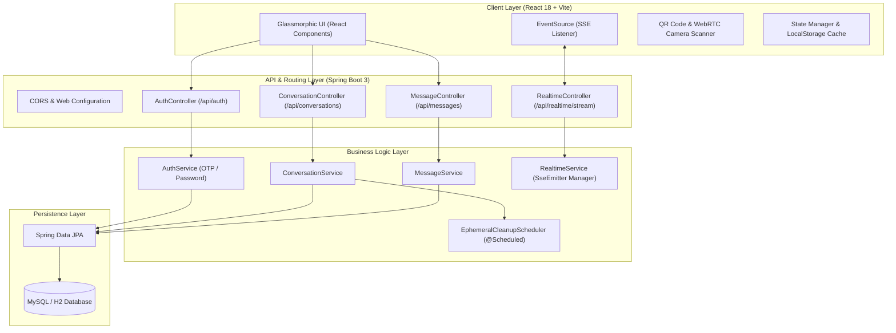

# ⚡ InstantConnect

> **Connect. Chat. Clear.**  
> A Full-Stack Ephemeral P2P Instant Messaging Web Application with Real-Time Synchronization, 30-Day Auto-Cleanup Engine, and Dual-Mode Authentication.

---

## 📌 Table of Contents
- [Overview](#-overview)
- [Key Features](#-key-features)
- [System Architecture](#-system-architecture)
- [Tech Stack](#-tech-stack)
- [Lifecycle & Color Coding System](#-lifecycle--color-coding-system)
- [Getting Started & Installation](#-getting-started--installation)
- [API Endpoints](#-api-endpoints)
- [Docker & Containerization](#-docker--containerization)
- [License](#-license)

---

## 🌟 Overview

**InstantConnect** is a modern peer-to-peer web messaging application designed for instant, privacy-first communication. It allows users to initiate real-time chat sessions using mobile numbers without saving contacts in their phone address book. Temporary conversations automatically expire after **30 days** unless explicitly saved permanently by the user.

---

## 🔥 Key Features

- **📱 P2P Instant Connect**: Start chatting immediately by entering a recipient's mobile number without saving contacts.
- **⏱️ 30-Day Ephemeral Lifecycle**: Automatic background cleanup (`@Scheduled`) purges temporary messages and expired chats after 30 days.
- **🔒 Permanence Control**: Lock & save important contacts with nicknames/aliases to bypass the auto-deletion timer.
- **📡 Real-Time SSE Synchronization**: Bi-directional live messaging using Server-Sent Events (`EventSource`) with fallback polling.
- **🔐 Dual-Mode Authentication**: Secure login via **SMS Verification OTP** or **Account Password** linked to user mobile numbers.
- **📷 QR Code Profile & Scanner**: Instant profile sharing via generated QR codes (`#connect?phone=...`) and HTML5 camera viewfinder scanner.
- **🎨 Glassmorphism UI & Time-Warp Controls**: Vibrant glassmorphism design system supporting Dark/Light modes and a simulated time-warp fast-forward bar (+1d, +25d, +30d) for lifecycle testing.

---

## 📐 System Architecture



---

## 💻 Tech Stack

### **Frontend**


### **Backend & APIs**


-000000?style=for-the-badge&logo=rss&logoColor=orange)

### **Database & Infrastructure**


---

## 🎨 Lifecycle & Color Coding System

| Tile Color | Status | Description |
| :--- | :--- | :--- |
| **🟢 Green** | **Active Temporary** | Newly started conversation (> 5 days remaining). |
| **🟡 Yellow** | **Expiring Soon** | Reached 5 days or less before automatic 30-day deletion. |
| **🔴 Red** | **Unavailable / Expired** | Chat room closed by recipient or reached expiration deadline. |
| **🔒 Lock Badge** | **Saved Permanently** | Saved with nickname/alias. Exempt from 30-day auto-cleanup. |

---

## 🌐 API Endpoints

### **Authentication**
- `POST /api/auth/send-otp` - Generate & dispatch SMS OTP to mobile number
- `POST /api/auth/verify-otp` - Verify 6-digit SMS OTP code
- `POST /api/auth/login-password` - Authenticate via mobile number & password

### **Conversations & Messages**
- `GET /api/conversations?userPhone={phone}` - Fetch user conversations
- `POST /api/conversations` - Create a new instant chat room
- `PUT /api/conversations/{id}/save` - Lock conversation permanently with alias
- `DELETE /api/conversations/{id}` - Delete conversation
- `GET /api/messages/{convId}` - Fetch conversation chat history
- `POST /api/messages` - Send a real-time message
- `GET /api/realtime/stream?userPhone={phone}` - Server-Sent Events (SSE) live updates stream

---

## 🛠️ Getting Started & Installation

### Prerequisites
- Node.js (v18+)
- Java JDK (v17+)
- Maven (v3.8+)

### 1. Clone Repository
```bash
git clone https://github.com/Manikanta-Meesala/InstantConnect.git
cd InstantConnect
```

### 2. Frontend Setup
```bash
npm install
npm run dev
```
*Frontend runs on `http://localhost:5173`*

### 3. Backend Setup
```bash
cd backend
./mvnw spring-boot:run
```
*Backend server runs on `http://localhost:8080`*

---

## ⚡ Production Build & Deploy
To build the React application and bundle static assets into Spring Boot:
```bash
npm run build
```

---

## 🐳 Docker & Containerization

Run the entire application (Frontend + Backend + Database) using Docker Compose:

```bash
docker-compose up --build -d
```

---

## 📄 License
Distributed under the MIT License.
